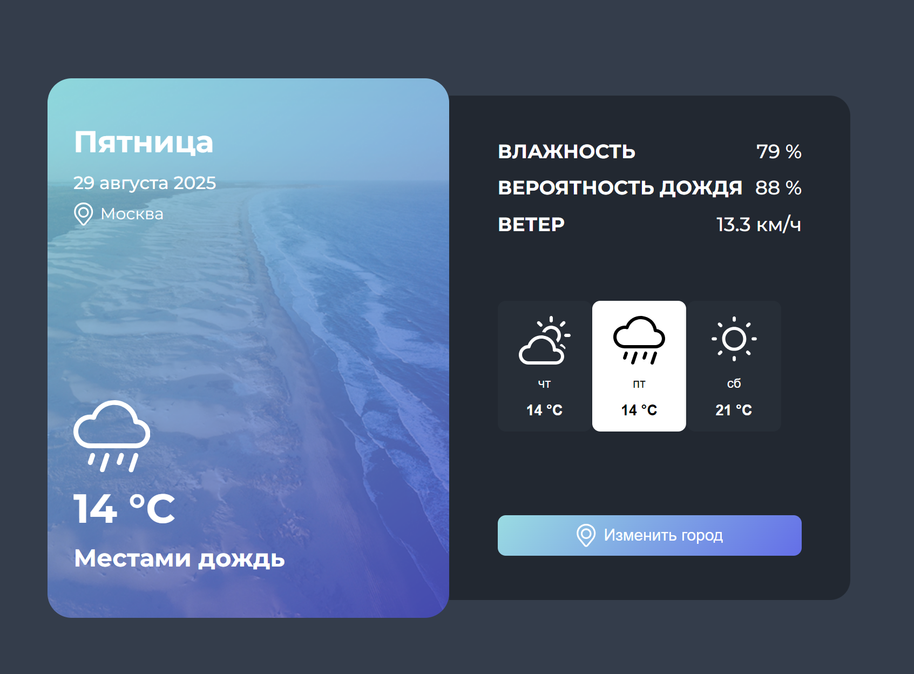

# Прогноз погоды

Приложение для просмотра прогноза погоды по выбранному городу. Позволяет узнать текущую погоду и прогноз на несколько дней вперед, включая такие параметры, как температура, влажность, осадки и ветер. Пользователь может самостоятельно выбрать город для получения актуальной информации, данные берутся с внешнего погодного API.



### Технологии

- [Vue 3](https://vuejs.org/) — основной фреймворк для построения пользовательского интерфейса
- [Vite](https://vitejs.dev/) — инструмент для сборки и разработки проекта
- [ESLint](https://eslint.org/) — статический анализатор кода для поддержания качества
- [Prettier](https://prettier.io/) — автоформатирование кода (через конфиг @vue/eslint-config-prettier)
- [WeatherAPI](https://www.weatherapi.com/) — внешний API для получения погодных

### Начало работы

1. Установите `node.js` Поддерживаемая версия сборки `22.18.0+`
2. Установите зависимости с помощью

```shell
npm ci
```

3. Запустите проект с помощью

```shell
npm run dev
```
